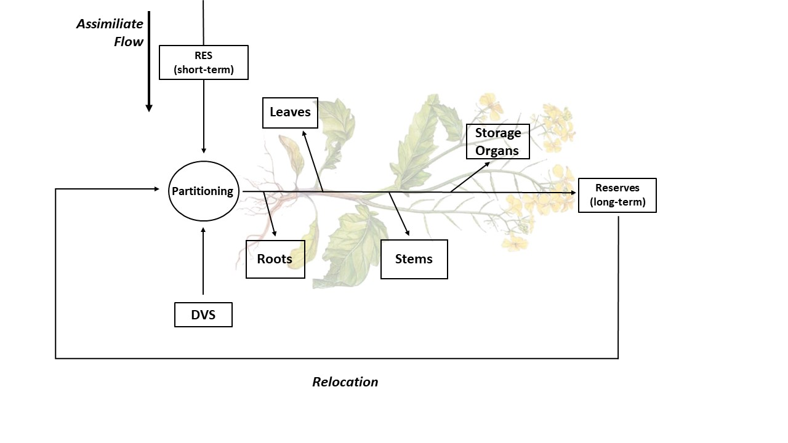
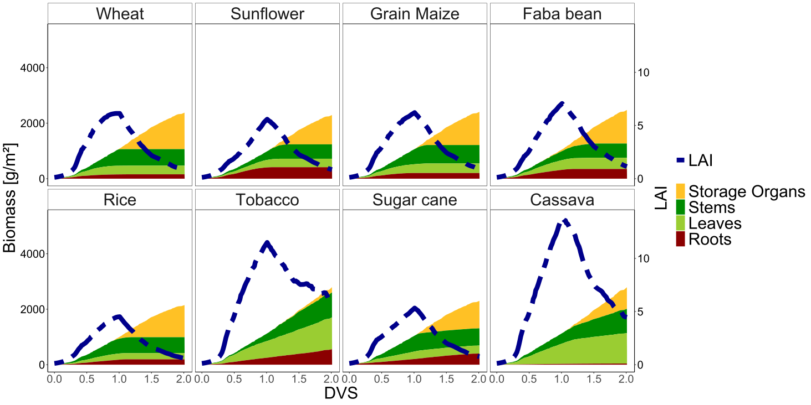

<style>
body {
text-align: justify}
</style>

```{r setup, include=FALSE}
knitr::opts_chunk$set(echo = TRUE)
knitr::opts_chunk$set(warning = FALSE)
require(DT)
require(dplyr)
require(ggplot2)
```

# Introduction

## Partitioning

Partitioning refers to the distribution of certain resources, f. ex macro- and micro nutrients, between the plant organs (these comprise plant roots, leaves, stems and the plants storage organs). This distribution is highly dependent and correlating with the plants development stage (*DVS*) which differs uniquely depending on the crop species. If a resource is highly accessible and not taken up completely by the plant organs, the resource can be reserved and later be relocated again.


```{r, echo=FALSE, fig.align="center", fig.cap="Figure: Visualisation for ressource allocation and organ partitioning"}

```

## Motivation/ Background

Climate change leads to changing environmental conditions for crops, those crops will respond to those changes with shifting biomass partitioning patters to obtain the most limiting resource, in f.ex months of droughts.

Furthermore, the ability to predict biomass partitioning patterns of crops in direct competition with one another has the potential to be a valuable tool in predicting the outcome of crop--weed competition. In general plants facing limited resource supply belowground will shift biomass partitioning towards more root and less shoot production whereas plants competing for light will shift towards more shoot and less root production.

Understanding partitioning patterns in crop production is an important goal to maximize a crops growth rate which leads to maximized biomass and therefore maximized yield.

# Goal

We develop a simplified partitioning model to calculate and visualize optimal allocation of resources between the different plant organs. We extend the model by adding a transpiration reducing factor (*TRANRF*) to review the model under the influence of drought stress. We put emphasis on the impact of the individuality of crop species by reviewing and visualizing partitioning patterns in different crop types.

# Model development

## Simile

### Basemodel

A simplified growth and LAI model was used as the base model, where after LAI reaching a value of 0.7, half of the growth rate (dW) is added to the fraction of the leaves.\
\
$$dD=
    \begin{cases}
    r_g\ *\ LAI\ &\   if\ LAI\ <\ 0.7\\ 
    s_{new}\ *\ p_l\ *\ dW &\ if\ LAI\ >\ 0.7\\
    \end{cases}$$\

### DVS

Due to the fact our model is build for spring wheat in temperate climate, we set the seeding date to 100, the beginning of April and used weather data of Dikopshof, west Germany, from 2007.  This gave realistic mean values for temperature and irradiation.\

In Addition, our model was dependent on the development state index (DVS) of the plant. The DVS is the ratio of the daily average temperature (Temperature) minus the base temperature (T_b) to the thermal time requirement (P_T) at a given point in the development. The base temperature and the thermal time requirement can differ between the phase before and after anthesis.\
\
$$dD=
    \begin{cases}
    max\left (\frac{(Temperature-T_{b1})}{P_{T1}}\right ) &\   if\ DVS\ <\ 1\\ 
    max \left ( \frac{(Temperature-T_{b2})}{P_{T2}} \right ) &\ if\ DVS\ >\ 1\\
    \end{cases}$$\
\
In order to stop growth rate after maturity is reached, dW is set to 0 after DVS = 2.\
\
$$dD=
    \begin{cases}
    RUE\ *\ I_{par}\ &\   if\ DVS\ \leq\ 2\\ 
    0\\
    \end{cases}$$\

### Partitioning

To add partitioning of the different plant growth organs, the fraction table for wheat was used. For each organ (Froot, FStems, FLeaves, FStorageOragan) a variable is created and multiplied by a sketched graph.  The curve consists of the defined points by the table and the interpolated points in the area between them.
It is known that all fractions together always add up to one and every fraction is not negative.\
\
$FRoot\ +\ FStems\ +\ FLeaves\ +\ FStorageOrgans\ =\ 1$\
\
In order to ensure that, the variable FShoot is created, to divide the fractions into below ground and above ground organs.\
\
$FShoot= 1\ -\ Froot$\
\
This is how to use only three graphs and calculate the fourth fraction from the other three.\
\
$FStorageOrgans= FShoot\ -\ (FStems\ +\ FLeaves)$\
\
To calculate the weight of the different organs (WLeaves, WStems, WRoots,WStoragOrgans) the growth rate dW is multiplied by the Fraction of each organ.\
\
$dWRoots= dW\ *\ Froot$\

$dWLeaves = dW\ *\ FLeaves$\

$dWStems= dw\ *\ FStems$\

$dWStorageOrgans= dw\ *\ FStorageOrgans$\

### Leaf Senescence

In this model, senescence is built into the LAI, where the LAI decreases from DVS 1. Also the LAI reacts on change of the growth rate of the Leaves Fraction.\
\
$$dLAI=
    \begin{cases}
    r_g\ *\ LAI\ &\ if\ LAI\ <\ 0.7\ und\ DVS\ <\ 0.3\\ 
    s_{new}\ *\ dWLeaves\  &\ if\ DVS\ <\ 1\\
    s_new\ *\ dWLeaves\ -\ 0.03\ *\ LAI  &\ if\ DVS\ >\ 1\\
    \end{cases}$$\
\
In general, exchanging the constant leaf partitioning p_l with the simulated leaf growth rate, allows the model a more realistic reflection on the growth behavior of the plant.\

### Modifying root partitioning due to drought

To show how partitioning behaves under drought stress, we add the variable TRANRF. The TRANRF is set to a fixed value of 0.3 for a certain period during development.\ 
\
$$dD=
    \begin{cases}
    0.3\ &\   if\ 0.2\ <\ DVS\ <\ 1.2\\ 
    0\\
    \end{cases}$$\
\
The TRANRF has an impact on the total growth rate dW, as well as the root Fraction. For this, the variable froot was added which is leading to an increasement of the root fraction and a decreasement of the other organ fractions.\
\
$froot=\ max\left ( 1,\frac{1}{(TRANRF+0.5)} \right)$\

### Model run and evaluation
The base model was compared to the model with implemented partitioning. Also the model was transferred to other crop species. The partitioning behavior was investigated under normal conditions, as well as under drought stress.\

## R

In addition to the Simile models, we have also created the same models in R again. These have the same model components and also the same input values as the models in Simile. Our main motivation behind the R models was to avoid the very time-consuming drawing of the organ fractions. By using R, we could read the data directly from the table and were not dependent on an intermediate medium such as the Simile graphs. While Simile is operated entirely via a graphical user interface, our R model is based purely on a line-based script. This made it sometimes difficult to keep an overview, because the characteristic components of Simile were not directly visible in the R code. Nevertheless, the model is also based on factors, compartments and flows that have to be defined at the beginning. Here the `numeric()` function is useful to create vectors for the variables that change during the simulation. For each of these variables, a vector is created with the length of the planned timesteps. These vectors are then exchanged with the newly calculated data points during the simulation. For constant factors, variables are defined with the corresponding constant value at the beginning. For compartment variables, the first digit in the associated vector is overwritten with the start value of the compartment from Simile.

After all model variables have been defined and prepared, the actual calculation of the model can begin. This works via a loop with a number of repetitions that corresponds to the desired timesteps of the simulation. Within the loop are the actual calculations of the model, which are performed one after the other, building on each other. It is important to keep to the correct order for the calculation of the individual variables, so that variables that are later calculated in the loop are not part of earlier calculations for other variables. The calculations and also the updating of the individual vectors are strongly based on indexing. In the current iteration (`n`), the values of the previous iteration (`n-1`) are exchanged with the newly calculated value. The formulas used in R are very similar to those in the Simile Model and only the syntax for if and else conditions had to be adapted. To calculate the compartments as in Simile, the flow rates at the end of each iteration are added to their corresponding variable, e.g. `W[n] <- dW[n-1] + W[n-1]`, and taken as the basis for the next iteration. After the last iteration has run, all the desired vectors can be merged into one data frame, which can then be used in different ways.

The implementation of the fractions directly from the table is one of the main differences to the simile models. The mechanism behind this can be divided into two steps. In the first step, the relevant fractions are filtered out of the entire table. The filter is based on the input in the model function where the desired crop can be specified. The default input is wheat, for which we have also drawn the fractions in Simile. In the second step, the data from the filtered table is used to interpolate a value that corresponds to the respective DVS value. For this, the `approx()` function was a great help, as it is able to interpolate for a value within a dataframe.

Our goal for the R models was to achieve results as close as possible to our simile results. In principle, the visible calculations of both models are the same, but nevertheless there are slight deviations. One influencing factor here is the different rounding of the two programmes. Even if the same numbers are displayed on the surface, it is possible that other numbers are calculated internally.

We have written a very simple function with which we can examine the results of two data frames and their difference. We found that the difference was smallest for the `no_partitioning` model and increased for the more complex models. A second source for differences between the models are also slight inaccuracies when drawing in Simile. To examine the differences between the two models more closely, there would have been another possibility. Simile allows to export the drawn graphs as a .csv table. These could then have been used as input in the R model for the fractions. The R model would still have interpolated from this data, but anomalies in the drawn data would have been represented.

-   Possible extensions
    -   probabilistic uncertainty
    -   Monte Carlo simulation
    -   Mehr Änderungen im Funktionsinput
-   nice backup by inline code

## List of variables

```{r, echo=FALSE, fig.align="center", fig.cap="List of the variables used in the models"}
variable_table <- read.csv2("data/variable_table.csv")
datatable(variable_table, class = 'cell-border stripe', rownames = FALSE, colnames = c('Variable name', 'Description', 'Unit', 'Value', 'Model', 'Simile component', 'Source/Reference'))
```


## Partitioning Fractions

Wie haben die Lintul Menschen diese Fractions bekommen?

# Results

## Without Partitioning

```{r, echo=FALSE, message=FALSE, fig.align="left", fig.cap="Visualisation for the partitioning simulation"}
source("scripts/plotting.R")
no_partitioning_data <- read.csv2("results/R_no_partitioning.csv")
no_partitioning <- melt_formatter(no_partitioning_data,"Wheat")

no_partitioning_plot <- area_plotter(no_partitioning[[1]],no_partitioning[[2]], no_partitioning[[3]])
no_partitioning_plot
```

## Partitioning

```{r, echo=FALSE, fig.align="left", fig.cap="Results table for the partitioning simulation"}
partitioning_wheat <- read.csv2("results/R_partitioning_wheat.csv")
partitioning_wheat <- partitioning_wheat[,-1]
datatable(
  partitioning_wheat,
  filter = 'top',
  extensions = "FixedColumns",
  options = list(
    pageLength=10,
    scrollX='400px',
    fixedColumns = list(leftColumns = 2)),
  class = 'cell-border stripe', rownames = FALSE)

```

```{r, echo=FALSE, message=FALSE, fig.align="left", fig.cap="Visualisation for the partitioning simulation"}
source("scripts/plotting.R")
partitioning_wheat <- read.csv2("results/R_partitioning_wheat.csv")
partitioning_wheat <- melt_formatter(partitioning_wheat,"Wheat")

partitioning_plot <- area_plotter(partitioning_wheat[[1]],partitioning_wheat[[2]], partitioning_wheat[[3]])
partitioning_plot
```


## Partitioning Other Crops

```{r, echo=FALSE, fig.align="center", fig.cap="Figure: Comparison of different crop simulated with the wheat model"}

```


```{r, eval=FALSE, echo=FALSE}
source("scripts/partitioning.R")
source("scripts/plotting.R")

partitioning_wheat <- read.csv2("results/R_partitioning_wheat.csv")
partitioning_wheat <- melt_formatter(partitioning_wheat,"Wheat")
nrow(partitioning_wheat[[1]])
nrow(cassava[[1]])
nrow(tobacco[[1]])
cassava <- partitioning(crop_name = "Cassava")
cassava <- melt_formatter(cassava,"Cassava")
tobacco <- partitioning(crop_name = "tobacco")
tobacco <- melt_formatter(tobacco,"tobacco")

data <- rbind(partitioning_wheat[[1]], cassava[[1]])#, tobacco[[1]])
data2 <- rbind(partitioning_wheat[[2]], cassava[[2]])#, tobacco[[2]])
name_list <- c(partitioning_wheat[[3]], cassava[[3]])#, tobacco[[3]])

plot <- area_plotter(data,data2,name_list)
plot
```

## Partitioning TRANRF

```{r, echo=FALSE, message=FALSE, fig.align="left", fig.cap="Comparison of fractions under drought stress"}
df1<- read.csv2("results/R_partitioning_TRANRF_wheat.csv")
df_sub <- df1[, c("DVS","FStorageOrgans","FStems","FLeaves","FRoot","FAll")]

dataT<-df_sub

title <- "Partitioning + TRANRF"

plotfilename <- title

dataT <- dataT[1:125,]
dataT$DVS <- as.numeric(dataT$DVS)
dataT$FRoot <- as.numeric(dataT$FRoot)
dataT$FLeaves <- as.numeric(dataT$FLeaves)
dataT$FStems <- as.numeric(dataT$FStems)
dataT$FStorageOrgans <- as.numeric(dataT$FStorageOrgans)

dvsStorageOrgans <- select(dataT, DVS, FStorageOrgans) %>% 
  mutate(newcol="Storage Organs") %>% 
  rename(Fraction=FStorageOrgans)
dvsStems <- select(dataT, DVS, FStems) %>% 
  mutate(newcol="Stems") %>% 
  rename(Fraction=FStems)
dvsLeaves <- select(dataT, DVS, FLeaves) %>% 
  mutate(newcol="Leaves") %>% 
  rename(Fraction=FLeaves)
dvsRoots <- select(dataT, DVS, FRoot) %>% 
  mutate(newcol="Roots") %>% 
  rename(Fraction=FRoot)

dataT <- rbind(dvsRoots,dvsLeaves, dvsStems, dvsStorageOrgans) %>% 
  rename(Organ=newcol) %>% 
  mutate(Organ = factor(Organ, levels = c("Storage Organs", "Stems", "Leaves", "Roots")))

dataT <- dataT[order(dataT$DVS),]
#dataT

####

df2<- read.csv2("results/R_partitioning_wheat.csv")

df_sub2 <- df2[, c("DVS","FStorageOrgans","FStems","FLeaves","FRoot","FAll")]

dataO<-df_sub2

titleO <- "Partitioning"

plotfilenameO <- titleO

dataO <- dataO[1:125,]
dataO$DVS <- as.numeric(dataO$DVS)
dataO$FRoot <- as.numeric(dataO$FRoot)
dataO$FLeaves <- as.numeric(dataO$FLeaves)
dataO$FStems <- as.numeric(dataO$FStems)
dataO$FStorageOrgans <- as.numeric(dataO$FStorageOrgans)

dvsStorageOrgans <- select(dataO, DVS, FStorageOrgans) %>% 
  mutate(newcol="Storage Organs") %>% 
  rename(Fraction=FStorageOrgans)
dvsStems <- select(dataO, DVS, FStems) %>% 
  mutate(newcol="Stems") %>% 
  rename(Fraction=FStems)
dvsLeaves <- select(dataO, DVS, FLeaves) %>% 
  mutate(newcol="Leaves") %>% 
  rename(Fraction=FLeaves)
dvsRoots <- select(dataO, DVS, FRoot) %>% 
  mutate(newcol="Roots") %>% 
  rename(Fraction=FRoot)

dataO <- rbind(dvsRoots,dvsLeaves, dvsStems, dvsStorageOrgans) %>% 
  rename(Organ=newcol) %>% 
  mutate(Organ = factor(Organ, levels = c("Storage Organs", "Stems", "Leaves", "Roots")))

dataO <- dataO[order(dataO$DVS),]
#dataO
#####

dataO <- mutate(dataO,crop=plotfilenameO)
dataT <- mutate(dataT,crop=plotfilename)

data <- rbind(dataT,dataO)


#all.equal(dataT,dataO)

#ggplot(df, aes(DVS, Fraction, group=Organ, color = Organ)) +


fractions<-ggplot(data= data, aes(DVS, Fraction, group=Organ, color = Organ)) + #geom_line(data2, mapping = aes(x=DVS, y=LAI/scaleFactor, color="LAI"),size=4, linetype=6) +
  geom_line(linewidth=4) +
  labs(y="Fractions")+
  facet_wrap(vars(crop))+
  theme(#axis.title.x = element_text(size = 30), 
        #axis.text.x = element_text(size = 20),
        #axis.title.y.left=element_text(color="black", size= 30),
        #axis.text.y.left=element_text(color="black", size= 20),
        #axis.title.y.right=element_text(color="black", size= 30, angle = 90, 'vjust = -0.05'),
        #axis.text.y.right=element_text(color="black", size= 20),
        legend.key = element_rect(colour = "transparent", fill = "white"),
        legend.title = element_blank(),
        #legend.text = element_text(size=20),
        #legend.title = element_text(size = 25),
        panel.grid.major = element_blank(),
        panel.grid.minor = element_blank(),
        panel.border = element_rect(color = "black", fill = NA),
        #panel.border = element_blank(),
        strip.background = element_rect(color="black",fill="white"),
        #strip.text = element_text(size=20),
        legend.position = "bottom",
        panel.background = element_blank(),
        axis.line = element_line(colour = "black"))+
  scale_color_manual(values= c("goldenrod1","green4","yellowgreen","red4"),
                     labels=c("Storage Organs","Stems","Leaves","Roots"))

fractions
```

## Root/ Shoot Ratio
```{r, echo=FALSE, message=FALSE, fig.align="left", fig.cap="Alteration of Root/Shoot Ratio under drought"}
library(patchwork)

partitioning_table <- read.csv2("results/R_partitioning_wheat.csv")
partitioning_biomass <- select(partitioning_table,c("DVS","W"))
partitioning_TRANRF_table <- read.csv2("results/R_partitioning_TRANRF_wheat.csv")
partitioning_TRANRF_biomass <- select(partitioning_TRANRF_table,c("W"))
partitioning_TRANRF_biomass<- rename(partitioning_TRANRF_biomass, W_TRANRF=W)

df_bio<-cbind(partitioning_biomass, partitioning_TRANRF_biomass)

drought<-ggplot(data= df_bio, aes(x=DVS)) +
  geom_line(aes(y= W, color="1"), linewidth=4)+
  geom_line(aes(y = W_TRANRF, color = "2"), linewidth=4)+ #geom_point(aes(data, colour=XYZ)) #------>legend
  labs(y="Biomass [g/m²]",
       title = "Total Biomass")+
  theme(#axis.title.x = element_text(size = 30), 
        #axis.text.x = element_text(size = 20),
        #axis.title.y.left=element_text(size= 30),
        #axis.text.y.left=element_text(size= 20),
        #plot.title = element_text(hjust = 0.5, size=20),
        panel.grid.major = element_blank(),
        panel.grid.minor = element_blank(),
        panel.border = element_rect(colour = "black", fill = NA),
        #panel.border = element_blank(),
        panel.background = element_blank(),
        legend.title = element_blank(),
        #legend.text = element_text(size=20),
        legend.key = element_rect(colour = "transparent", fill = "white"),
        legend.position = "none",
        axis.line = element_line(colour = "black"))+
  scale_color_manual(values= c("slategray3","orangered4"),
                     labels=c("Control","Drought"))
#drought

df_R_S<- data.frame(
  group= (c("Control","Drought")),
  ratio= c(0.15, 0.28)
)
ratio <- ggplot(df_R_S, aes(x = group, y = ratio, color = group)) + #f + geom_col(aes(color = dose), fill = "white") +
  geom_bar(stat = "identity", fill="white", size=4, alpha=1) +
  labs(y = "R/S",
       title = "Root/ Shoot Ratio") +
  theme(axis.title.x = element_blank(),
        #axis.text.x = element_text(size = 30),
        #axis.title.y.right = element_text(size= 30, angle = 90),
        #axis.text.y.right = element_text(size= 20),
        #plot.title = element_text(hjust = 0.5, size=20),
        panel.grid.major = element_blank(),
        panel.grid.minor = element_blank(),
        panel.border = element_rect(colour = "black", fill = NA),
        panel.background = element_blank(),
        legend.title = element_blank(),
        #legend.text = element_text(size=20),
        legend.key = element_rect(colour = "transparent", fill = "white"),
        axis.line = element_line(colour = "black")) +
  scale_color_manual(values=c("slategray3","orangered4"), labels=c("Control","Drought"))+
  scale_y_continuous(position = "right")

#ratio

both<- drought+ratio
both
```

## Harvest Index
```{r, echo=FALSE, message=FALSE, fig.align="left", fig.cap="Harvest Index comparison"}
df_st<- data.frame(
  cat= (c("BM","GM","BM","GM")),
  con= (c("Control","Control","Drought","Drought")),
  val= c(1065.6, 1313, 603.53, 342.12)
)     

#head(df_st)

plot_st<- ggplot(df_st, aes(fill=cat, y= val, x= con))+
  geom_bar(position= "stack", stat = "identity")+
  labs(y="[g/m²]",
       title = "Biomass")+
  theme(axis.title.x = element_blank(), 
        #axis.text.x = element_text(size = 30),
        #axis.title.y.left=element_text(size= 30),
        #axis.text.y.left=element_text(size= 20),
        #plot.title = element_text(hjust = 0.5, size=20),
        panel.grid.major = element_blank(),
        panel.grid.minor = element_blank(),
        panel.border = element_rect(colour = "black", fill = NA),
        #panel.border = element_blank(),
        panel.background = element_blank(),
        legend.title = element_blank(),
        #legend.text = element_text(size=20),
        legend.key = element_rect(colour = "transparent", fill = "white"),
        legend.position="bottom",
        axis.line = element_line(colour = "black"))+
  scale_fill_manual(values=c("slategray3","goldenrod1"),
                    labels=c("Total Biomass","Grain Biomass"))

#plot_st


#####################################

df_HI<- data.frame(
  con= (c("Control","Drought")),
  val= c(0.55, 0.36)
)     

#head(df_HI)


plot_HI<- ggplot(df_HI, aes(x=con, y=val, color = con)) +
  geom_bar(stat = "identity", fill="white", size=4, alpha=1) +
  #ylim(0, 1)+
  labs(y = "HI",
       title = "Harvest Index") +
  theme(axis.title.x = element_blank(),
        #axis.text.x = element_text(size = 30),
        #axis.title.y.right = element_text(size= 30, angle = 90, vjust = -0.05),
        #axis.text.y.right = element_text(size= 20),
        #plot.title = element_text(hjust = 0.5, size=20),
        panel.grid.major = element_blank(),
        panel.grid.minor = element_blank(),
        panel.border = element_rect(colour = "black", fill = NA),
        panel.background = element_blank(),
        legend.title = element_blank(),
        #legend.text = element_text(size=20),
        legend.key = element_rect(colour = "transparent", fill = "white"),
        legend.position="bottom",
        axis.line = element_line(colour = "black")) +
  scale_color_manual(values=c("slategray3","orangered4"), labels=c("HI Control","HI Drought"))+
  scale_y_continuous(position = "right", limits = c(0, 1))

#plot_HI


st_HI<- plot_st+plot_HI
st_HI
```

# Simplification of the Model 

The influence of drought stress was modeled with the TRANRF. Due to simplification, the TRANRF was a fixed value and not calculated by formula. This had the impact, that growth and partitioning was effected by drought, as long as the TRANRF was applied. After this, growth and partitioning is acting normal again (please see results).\

# Conclusion 

Partitioning of biomass  the process by which plants distribute their energy amongst their different organs. Our partitioning model reveals how spring wheat allocates its biomass into leaves, roots, stems and storage organs. Therefore it gives a more accurate representation of the growth behavior of the plant, in contrast to the base model, where a fixed fraction (p_l) is given only into the leaves. This results in a slightly decreasing LAI, due to remaining constant leaf partitioning factor (p_l) and also an increased biomass. Our model in contrast allows more realistic LAI values with about 6 at time of flowering (DVS=1).\
\
Furthermore the partitioning model gives an impression of how much energy the plant invests into the respective organs at different times of development. Whereas until the time of flowering (DVS<1) the roots and the leaves fraction are finally decreasing, the fraction of the stems are increasing. This is possibly due to the stem elongation. After flowering is reached, all the energy is put into the storage organs.\
\
Under optimal partitioning theory, plants preferentially allocate biomass to acquire the resource that most limits growth. Here, drought stress was used as a limiting factor. Plants show certain changes in their growth patterns and physiological process to cope with the effects of drought stress. Our partitioning model showed an influence on the total biomass, as well as changing the ratio of the individual organs to each other. Whereas the total biomass and within the Harvest Index are reduced, the fraction of the roots are increasing. This leads to a higher root to shoot ratio under drought conditions. Such a strategy enables the plant to improve water absorption capacity and lower the biomass above ground to reduce transpiration and water loss.\
\
Nevertheless, the partitioning model has a certain weaknesses. Thus, the drought stress is only taken into account when TRANRF is applied at the specific period during development. This has the effect that earlier drought stress (DVS<1) does not concern later development (DVS>1), after setting TRANRF back to 1. The storage organs develop normal and showing only a lower biomass due to lower amount of leaves and stems. Eventually the model is suitable to show certain trends in how the plant changes its partitioning under drought stress.\
\
The partitioning model was created for spring wheat in temperate climate. So with constant variables, care must be taken when applying the model to different species. If variables such as temperature or thermal time requirement are not adjusted, the results will vary greatly depending on the crop species.   

# Outlook 
The process of partitioning depends on a complex interaction of multiple factors, such as abiotic, biotic stress, phytohormones or genotype. In order to obtain more realistic results, additional factors could be included in the model.\
\
One major improvement would be the calculation of the TRANRF, rather than taking a fixed and constant value. Therefore the potential transpirative demand (PTRAN) as well as actual transpiration (TRAN) can be quantified. Since water availability of a crop depends on Rooting depth and density, as well as maximum root uptake rate and soil hydraulic conductivity.\
\
Also interesting would be to see how the plant allocates various nutrients into  different organs. The seasonal patterns of nitrogen uptake could be considered, as nitrogen stress can have an impact on allocation patterns of plants.\
\
In addition, the model can be adapt specifically to various crops and their growing demands. So the different location factors, such as temperature or irradiation can be adapted. According to annual and perennial plants it is crucial to adjust the vegetation period. 

